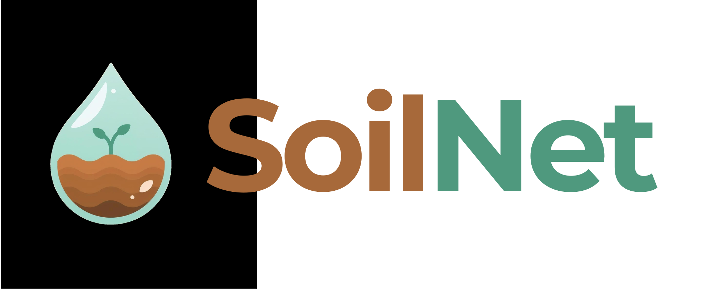

<p align="center">
  
</p>

**SoilNet** is a full-stack IoT platform for precision agriculture. It provides real-time monitoring of soil moisture, helping users make data-driven decisions to optimize irrigation. The system includes a predictive model using Machine Learning to forecast future soil moisture levels.

##  Features

*   **Real-time Monitoring**: View current soil humidity, battery levels, and signal strength (RSSI) for all your sensor nodes.
*   **Interactive Dashboard**: Get a quick overview of your system's health with calculated KPIs and status indicators (Optimal, Warning, Critical).
*   **Historical Data**: Visualize trends over time with interactive charts (24h, 7 days, 30 days).
*   **Machine Learning Predictions**: A predictive simulator estimates future soil moisture based on current sensor data.
*   **Automated Model Re-training**: A weekly cron job automatically re-trains the ML model with the latest data to maintain prediction accuracy.
*   **Smart Alerts**: Receive automatic notifications for critical events like low humidity, weak signal, or sensor inactivity.
*   **Admin Panel**: Comprehensive management system for administrators to create users, register nodes, and assign devices.
*   **Role-Based Access**: Secure authentication with distinct roles for Administrators and Standard Users.

##  Tech Stack

*   **Frontend**: React.js, Vite
*   **Styling**: Tailwind CSS
*   **Charts**: Recharts
*   **Backend**: Node.js, Express
*   **Database**: MongoDB
*   **Authentication**: JWT (JSON Web Tokens)
*   **Machine Learning**: Python, Scikit-learn, Pandas, LightGBM

##  Installation

Follow these steps to run the project locally:

### Prerequisites
*   Node.js (v18 or superior)
*   Python (v3.8 or superior)
*   MongoDB

### 1. Clone the repository
    ```bash
    git clone https://github.com/Alexxxjon/SoilNet.git
    cd SoilNet
    ```

### 2. Backend Setup
    Navigate to the backend directory and install dependencies:
    ```bash
    cd backend
    npm install
    ```
    Create a `.env` file in the `backend/` directory and add your database connection string and a JWT secret:
    ```env
    PORT=3000
    MONGO_URI=YOUR_MONGODB_CONNECTION_STRING
    JWT_SECRET=YOUR_SUPER_SECRET_KEY_FOR_JWT
    ```
    Start the server:
    ```bash
    node index.js
    ```

### 3. Machine Learning Module Setup
    Navigate to the ML directory and install the required Python packages:
    ```bash
    cd backend/ml
    pip install -r requirements.txt
    ```
    This will install `pandas`, `scikit-learn`, `lightgbm`, and `joblib`.

### 4. Frontend Setup
    Open a new terminal, navigate to the frontend directory, and install dependencies:
    ```bash
    cd frontend
    npm install
    ```
    Create a `.env` file in `frontend/` and specify the backend API URL:
    ```env
    VITE_API_URL=http://localhost:3000
    ```
    Run the application:
    ```bash
    npm run dev
    ```

##  Deployment

The frontend of the application is deployed and accessible at:
 **[wikiclone.info](https://wikiclone.info)**

The project is designed to be deployed as two separate services:

*   **Backend (API)**: Deployed on a service like **Render**.
    *   Set the `MONGO_URI` and `JWT_SECRET` environment variables in your Render service settings.
    *   Ensure the build command installs Python dependencies if needed, or use a Docker container.

*   **Frontend (PWA)**: Deployed on **Vercel**.
    *   Connect your Git repository to Vercel.
    *   Set the **Root Directory** to `frontend` in the project settings.
    *   Configure the following Environment Variables in your Vercel project settings:
        *   `VITE_API_URL`: The URL of your deployed backend (e.g., `https://soilnet-backend.onrender.com`).

##  Contributing

Contributions, issues, and feature requests are welcome! Feel free to check the issues page.

##  License

This project is licensed under the MIT License.

---
<p align="center">Made with  for better agriculture.</p>
